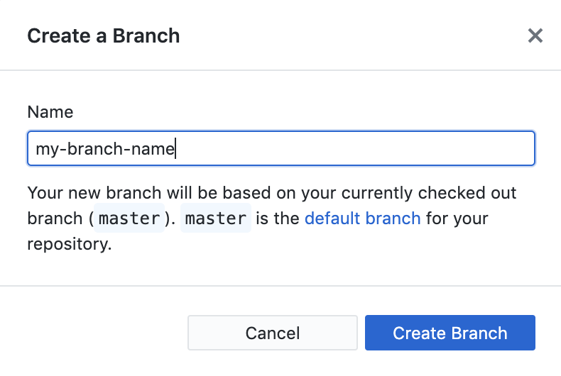

# How to Make a Pull Request With GitHub Desktop

On GitHub, you can make changes to another person's repository and suggest that they accept your changes. This is called making a pull request. The easiest way to do this is using an app called GitHub Desktop. 

1. [Make a GitHub account.](https://github.com/) 

2. [Install GitHub Desktop.](https://desktop.github.com)

3. **Forking the repository:** Go to the repository you want to contribute to (for example, <https://github.com/walnutprogramming/Directions>). Click on "*Fork*" in the top right. (**Forking** a repo makes a copy on GitHub so that you have your own repo on GitHub.)

4. **Cloning your forked repository:** In your fork, click on the green "*Clone or download*" button and click on "*Open in Desktop*". (**Cloning** a repo makes a copy of your forked repo on your computer so that you can make changes on your computer and send them back to your fork.) 

5. **Creating a new branch for your changes:** In GitHub Desktop, click on "*Branch*", then type in a name for your new **branch**. For example, if you're fixing a typo, you might name the branch "`typo-fix`". (A **branch** allows you to keep your changes separate. `master` is the name of the default branch that shows the current state of your project, but if you want to make a change, you should make a new branch so that it can be merged into `master`.)

6. **Making the changes:** Open a text editor and make the changes you want to make to the repository. (If you're not sure what you can do to help, you can look in the "*Issues*" tab on GitHub to see what problems need to be fixed.)
7. **Committing your changes:** Now you can make a **commit** on the repository on your computer. In GitHub Desktop, you should see the files that you changed checked in the left sidebar. In the bottom of the left sidebar, type in a summary and description of the changes you made. 

8. **(Optional) Make more changes:** If there's more stuff you want to change before you submit your pull request, you can still change more files and commit again (steps 6-7).
9. **Publish your branch back to your fork or push to your fork:** In GitHub Desktop, click on "Publish branch" in the top bar. If you've already published the branch, you can press "Push origin" to add your new changes to the branch on GitHub. 

10. **Creating a pull request:** Click on "Create Pull Request" in GitHub Desktop (or go to your fork in GitHub, and click "New pull request"). Type in a description of the changes you made so that others can decide whether to accept your changes. 

11. **Wait for others to comment on your pull request.** If you want to make changes to your pull request, there are instructions on how to do that on the page for the pull request. 

12. **(Optional) Clean up your forked repo:** Once your pull request has been merged, you can update your branch by following [these instructions from a StackOverflow answer](https://stackoverflow.com/questions/46110615/how-to-sync-your-forked-repo-with-original-repo-in-github-desktop/53538020#53538020).

In October, if you make 4 pull requests, you can get a free T-Shirt from Hacktoberfest. Sign up [here](https://hacktoberfest.digitalocean.com/).

If there's anything unclear about these instructions, feel free to make a pull request on this repository to make these instructions easier to follow.
